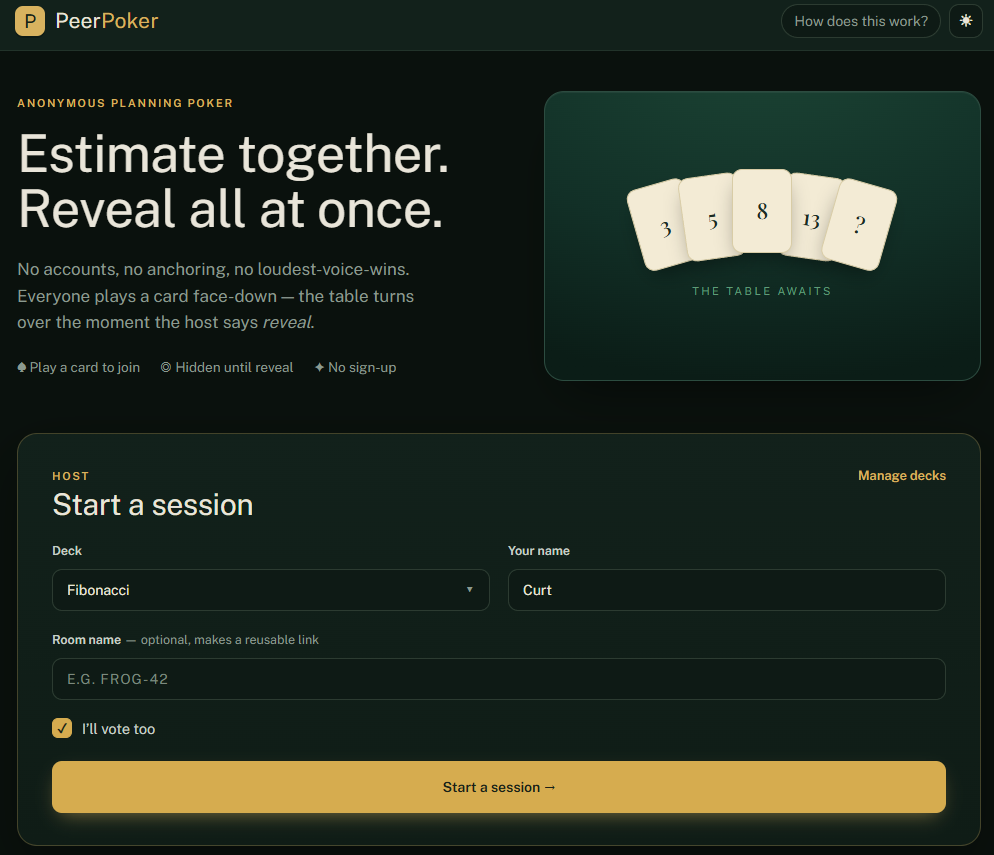

# PeerPoker



Serverless, peer-to-peer **planning poker**. A host runs a live estimation session;
participants join from a shared link and vote with story-point cards. There is **no
backend** — your votes, tickets, and results are exchanged **directly between the people in
the room over WebRTC** and never touch a server.

- **No server holds your data.** Only the WebRTC connection handshake briefly involves a
  third party (PeerJS broker + STUN) — connection metadata only, never your votes or
  tickets. No TURN relay.
- **Decks** — Fibonacci built in; create your own (numbers, T-shirt sizes, `?`, `☕`).
  Multiple named decks, remembered locally.
- **Sessions** — pre-plan an agenda or add items ad-hoc mid-meeting. Host reveals when ready;
  re-vote to converge; accept a final estimate per item.
- **Reference links** — give an item a URL and its title becomes a link everyone at the table
  can click. Nothing is fetched or looked up; it's a link, not an integration.
- **Change your mind** — re-pick your card freely, right up until the host accepts a value.
  Seeing the table is exactly when people reconsider.
- **Yours to theme** — dark by default, switch to light any time.
- **Export** — copy / CSV / JSON of the agreed estimates at the end.

## Run it locally

```bash
cd app
npm install
npm run dev     # http://localhost:8000/peer-poker/
```

`npm run build` emits a static bundle to `app/dist`; `npm run test` and
`npm run lint` cover the domain logic and code style. Deployment notes are in
[`app/DEPLOY.md`](app/DEPLOY.md).

## Status

Early build. Design in [`docs/design.md`](docs/design.md), implementation plan in
[`docs/plan.md`](docs/plan.md), key decisions in [`docs/adr/`](docs/adr/).

## Stack

Vite + React + TypeScript + Zustand + Tailwind (dark default, light optional) + PeerJS.
The app lives in [`app/`](app/). See the plan for the build sequence.

## License

[MIT](LICENSE).

### Fonts

The app self-hosts two open-source families rather than loading them from a CDN, so no
third-party request is made at runtime. Each is licensed under the
[SIL Open Font License 1.1](app/public/OFL.txt), which is served alongside them:

- **Public Sans** — Copyright 2015 The Public Sans Project Authors
- **Space Mono** — Copyright 2016 The Space Mono Project Authors
